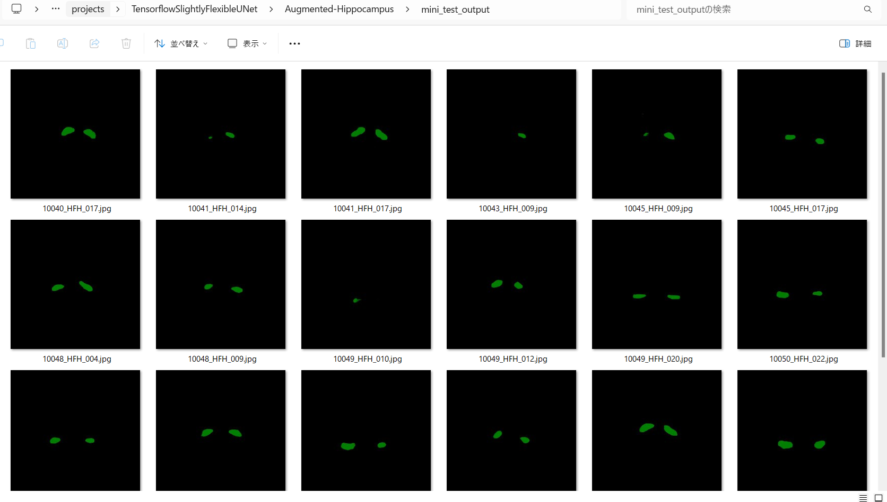

<h2>Tensorflow-Image-Segmentation-Augmented-Hippocampus (Updated: 2024/02/23)</h2>

This is the second experimental Image Segmentation project for Hippocampus based on
the <a href="https://github.com/sarah-antillia/Tensorflow-Image-Segmentation-API">Tensorflow-Image-Segmentation-API</a>, and
<a href="https://drive.google.com/file/d/1FAgeAlwvzCscZVvAovqpsTQdum90_7y-/view?usp=sharing">
Hippocampus-ImageMask-Dataset.zip</a> (Updated: 2024/02/21).
  
 

 
<li>2024/02/21: Modified to use the latest dataset (rotated 90 degrees counterclockwise)
<a href="https://drive.google.com/file/d/1FAgeAlwvzCscZVvAovqpsTQdum90_7y-/view?usp=sharing">
Hippocampus-ImageMask-Dataset.zip</a> (Updated:2024/02/21).
</li>
<li>2024/02/21: Modified the parameters in [augmentor] section in 
    <a href="./projects/TensorflowSlightlyFlexibleUNet/Augmented-Hippocampus/train_eval_infer.config">train_eval_infer.config</a> 
</li>
<li>2024/02/23: Added [segmentation] section to 
<a href="./projects/TensorflowSlightlyFlexibleUNet/Augmented-Hippocampus/train_eval_infer.config">train_eval_infer.config</a> 
to be able to colorize the inferred segmentation regions.
</li>
<li>2024/02/23: Modified loss parameter in [model] setction to be "bce_dice_loss" in   
<a href="./projects/TensorflowSlightlyFlexibleUNet/Augmented-Hippocampus/train_eval_infer.config">train_eval_infer.config</a> 
to be able to colorize the inferred mask regions.
</li>
<li>2024/02/23: Updated <a href="./src/TensorflowUNet.py">TensorflowUNet.py</a> and <a href="./src/GrayScaleImageWriter.py">GrayScaleImageWriter.py</a>.
</li>

 

In order to improve segmentation accuracy, we will use an online dataset augmentation strategy based on Python script <a href="./src/ImageMaskAugmentor.py">
ImageMaskAugmentor.py</a> to train a Pancreas Segmentation Model.  
Please see also our first experiment 
<a href="https://github.com/atlan-antillia/Tensorflow-Image-Segmentation-Hippocampus">Tensorflow-Image-Segmentation-Hippocampus</a>
 
 
As a first trial, we use the simple UNet Model 
<a href="./src/TensorflowUNet.py">TensorflowSlightlyFlexibleUNet</a> for this Hippocampus Segmentation. 
As shown in <a href="https://github.com/sarah-antillia/Tensorflow-Image-Segmentation-API">Tensorflow-Image-Segmentation-API</a>.
you may try other Tensorflow UNet Models: 

<li><a href="./src/TensorflowSwinUNet.py">TensorflowSwinUNet.py</a></li>
<li><a href="./src/TensorflowMultiResUNet.py">TensorflowMultiResUNet.py</a></li>
<li><a href="./src/TensorflowAttentionUNet.py">TensorflowAttentionUNet.py</a></li>
<li><a href="./src/TensorflowEfficientUNet.py">TensorflowEfficientUNet.py</a></li>
<li><a href="./src/TensorflowUNet3Plus.py">TensorflowUNet3Plus.py</a></li>
 

<h3>1. Dataset Citation</h3>

The original image dataset used here has been taken from the following kaggle web site. 
<a href="https://www.kaggle.com/datasets/andrewmvd/hippocampus-segmentation-in-mri-images">
Hippocampus Segmentation in MRI Images</a> 
 
<b>About Dataset</b>
<pre>
Introduction
The hippocampus is a structure within the brain that plays important roles in the 
consolidation of information from short-term memory to long-term memory, and in spatial 
memory that enables navigation. 
Magnetic resonance imaging is often the optimal modality for brain medical imaging studies, 
being T1 ideal for representing structure.
The hippocampus has become the focus of research in several neurodegenerative disorders. 
Automatic segmentation of this structure from magnetic resonance (MR) imaging scans of the 
brain facilitates this work, especially in resource poor environments.
</pre>
<b>About This Dataset</b>
<pre>
This dataset contains T1-weighted MR images of 50 subjects, 40 of whom are patients with 
temporal lobe epilepsy and 10 are nonepileptic subjects. Hippocampus labels are provided 
for 25 subjects for training. For more information about the dataset, refer to the 
original article.

How To Cite this Dataset
Original Article
K. Jafari-Khouzani, K. Elisevich, S. Patel, and H. Soltanian-Zadeh, 
“Dataset of magnetic resonance images of nonepileptic subjects and temporal lobe epilepsy 
patients for validation of hippocampal segmentation techniques,” 
Neuroinformatics, 2011.

License
The dataset is free to use for research and education. 
Please refer to the original article if you use it in your publications.

Dataset BibTeX
@article{,
title= {MRI Dataset for Hippocampus Segmentation (HFH) (hippseg_2011)},
keywords= {},
author= {K. Jafari-Khouzani and K. Elisevich, S. Patel and H. Soltanian-Zadeh},
abstract= {This dataset contains T1-weighted MR images of 50 subjects, 40 of whom are patients
with temporal lobe epilepsy and 10 are nonepileptic subjects. Hippocampus labels are provided 
for 25 subjects for training. The users may submit their segmentation outcomes for the 
remaining 25 testing images to get a table of segmentation metrics.},
terms= {The dataset is free to use for research and education. Please refer to the following 
article if you use it in your publications:
K. Jafari-Khouzani, K. Elisevich, S. Patel, and H. Soltanian-Zadeh, 
“Dataset of magnetic resonance images of nonepileptic subjects and temporal lobe epilepsy 
patients for validation of hippocampal segmentation techniques,” Neuroinformatics, 2011.},
license= {free to use for research and education},
superseded= {},
url= {https://www.nitrc.org/projects/hippseg_2011/}
}
</pre>

<h3>
<a id="2">
2 Hippocampus ImageMask Dataset
</a>
</h3>
 If you would like to train this Hippocampus Segmentation model by yourself,
 please download the latest dataset(rotated 90 degrees counterclockwise) from the google drive 
<a href="https://drive.google.com/file/d/1FAgeAlwvzCscZVvAovqpsTQdum90_7y-/view?usp=sharing">
Hippocampus-ImageMask-Dataset.zip</a> (Updated: 2024/02/21).

Please see also the <a href="https://github.com/atlan-antillia/Hippocampus-Image-Dataset">Hippocampus-Image-Dataset</a>. 
Please expand the downloaded ImageMaskDataset and place them under <b>./dataset</b> folder to be

<pre>
./dataset
└─Hippocampus
    ├─test
    │  ├─images
    │  └─masks
    ├─train
    │  ├─images
    │  └─masks
    └─valid
        ├─images
        └─masks
</pre>
 
 
<b>Hippocampus Dataset Statistics</b> 
 

As shown above, the number of images of train and valid dataset is not necessarily large. Therefore the online dataset augmentation strategy may 
be effective to improve segmentation accuracy.

 

<h3>
<a id="3">
3 TensorflowSlightlyFlexibleUNet
</a>
</h3>
This <a href="./src/TensorflowUNet.py">TensorflowUNet</a> model is slightly flexibly customizable by a configuration file. 
For example, <b>TensorflowSlightlyFlexibleUNet/Hippocampus</b> model can be customizable
by using <a href="./projects/TensorflowSlightlyFlexibleUNet/Augmented-Hippocampus/train_eval_infer.config">train_eval_infer.config</a>
<pre>
; train_eval_infer.config
; Pancreas, GENERATOR_MODE=True
; 2024/02/21 (C) antillia.com
; 2024/02/22 Modified to use 
; loss           = "bce_dice_loss"

[model]
generator     = True
image_width    = 512
image_height   = 512
image_channels = 3
num_classes    = 1
base_filters   = 16
base_kernels   = (5,5)
num_layers     = 7
dropout_rate   = 0.08
learning_rate  = 0.0001
clipvalue      = 0.5
dilation       = (2,2)
;loss           = "bce_iou_loss"
loss           = "bce_dice_loss"
metrics        = ["binary_accuracy"]
show_summary   = False

[train]
epochs        = 100
batch_size    = 4
steps_per_epoch  = 200
validation_steps = 100
patience      = 10
;metrics       = ["iou_coef", "val_iou_coef"]
metrics       = ["binary_accuracy", "val_binary_accuracy"]
model_dir     = "./models"
eval_dir      = "./eval"
image_datapath = "../../../dataset/Hippocampus/train/images/"
mask_datapath  = "../../../dataset/Hippocampus/train/masks/"
create_backup  = False
learning_rate_reducer = False
save_weights_only = True

[eval]
image_datapath = "../../../dataset/Hippocampus/valid/images/"
mask_datapath  = "../../../dataset/Hippocampus/valid/masks/"

[test] 
image_datapath = "../../../dataset/Hippocampus/test/images/"
mask_datapath  = "../../../dataset/Hippocampus/test/masks/"

[infer] 
images_dir    = "../../../dataset/Hippocampus/test/images/"
output_dir    = "./test_output"
merged_dir    = "./test_output_merged"

[segmentation]
colorize      = True
black         = "black"
white         = "green"
blursize      = None

[mask]
blur      = True
blur_size = (5,5)
binarize  = True
#threshold = 128
threshold = 74

[generator]
debug     = True
augmentation   = True

[augmentor]
;2024/02/21 vflip=False
vflip    = False
hflip    = True
rotation = True
angles   = [5, 10,]
shrinks  = [0.8]
shears   = [0.2]
transformer = True
alpah       = 1300
sigmoid     = 8

</pre>

Please note that the online augementor 
<a href="./src/ImageMaskAugmentor.py">
ImageMaskAugmentor.py</a> reads the parameters in [generator] and [augmentor] sections, and yields some images and mask depending on the batch_size,
 which are used for each epoch of the training and evaluation process of this UNet Model. 
<pre>
[augmentor]
vflip    = False
hflip    = True
rotation = True
angles   = [5, 10,]
shrinks  = [0.8]
shears   = [0.2]
transformer = True
alpah       = 1300
sigmoid     = 8
</pre>
Depending on these parameters in [augmentor] section, it will generate hflipped, rotated, shrinked,
sheared, elastic-transformed images and masks
from the original images and masks in the folders specified by image_datapath and mask_datapath in 
[train] and [eval] sections. 
<pre>
[train]
image_datapath = "../../../dataset/Hippocampus/train/images/"
mask_datapath  = "../../../dataset/Hippocampus/train/masks/"
[eval]
image_datapath = "../../../dataset/Hippocampus/valid/images/"
mask_datapath  = "../../../dataset/Hippocampus/valid/masks/"
</pre>

For more detail on ImageMaskAugmentor.py, please refer to
<a href="https://github.com/sarah-antillia/Image-Segmentation-ImageMaskDataGenerator">
Image-Segmentation-ImageMaskDataGenerator.</a>.
    
 

<h3>
3.1 Training
</h3>
Please move to a <b>./projects/TensorflowSlightlyFlexibleUNet/Augmented-Hippocampus</b> folder, 
and run the following bat file to train TensorflowUNet model for Hippocampus. 
<pre>
./1.train_generator.bat
</pre>
, which simply runs <a href="./src/TensorflowUNetGeneratorTrainer.py">TensorflowUNetGeneratorTrainer.py </a>
in the following way.

<pre>
python ../../../src/TensorflowUNetGeneratorTrainer.py ./train_eval_infer.config
</pre>
Train console output: 
 
Train metrics: 
 
Train losses: 
 
 
The following debug setting is helpful whether your parameters in [augmentor] section are good or not good.
<pre>
[generator]
debug     = True
</pre>
You can check the yielded images and mask files used in the actual train-eval process in the following folders under
<b>./projects/TensorflowSlightlyFlexibleUNet/Augmented-Hippocampus/</b>.  
<pre>
generated_images_dir
generated_masks_dir
</pre>

Sample images in generated_images_dir 
 
Sample masks in generated_masks_dir 
 

<h3>
3.2 Evaluation
</h3>
Please move to a <b>./projects/TensorflowSlightlyFlexibleUNet/Augmented-Hippocampus</b> folder, 
and run the following bat file to evaluate TensorflowUNet model for Hippocampus. 
<pre>
./2.evaluate.bat
</pre>
<pre>
python ../../../src/TensorflowUNetEvaluator.py ./train_eval_infer_aug.config
</pre>
Evaluation console output: 

<pre>
Test loss    :0.0625
Test accuracy:0.9987999796867371
</pre>

As shown above, Test loss, "bce_dice_loss" for test dataset, has been slightly improved compared to the case of "bce_iou_loss". 

<h2>
3.3 Inference
</h2>
Please move to a <b>./projects/TensorflowSlightlyFlexibleUNet/Augmented-Hippocampus</b> folder 
,and run the following bat file to infer segmentation regions for images by the Trained-TensorflowUNet model for Hippocampus. 
<pre>
./3.infer.bat
</pre>
<pre>
python ../../../src/TensorflowUNetInferencer.py ./train_eval_infer_aug.config
</pre>
Sample test images 
 
Sample test mask (ground_truth) 
 

 
Inferred test masks 
 
 
Merged test images and inferred masks  
  

Enlarged samples 
<table>
<tr>
<td>
test/images/10040_HFH_017.jpg 

</td>
<td>
Inferred merged/10040_HFH_017.jpg 

</td> 
</tr>

<tr>
<td>
test/images/10048_HFH_004.jpg 

</td>
<td>
Inferred merged/10048_HFH_004.jpg 

</td> 
</tr>

<tr>
<td>
test/images/10049_HFH_012.jpg 

</td>
<td>
Inferred merged/10049_HFH_012.jpg 

</td> 
</tr>

<tr>
<td>
test/images/10053_HFH_018.jpg 

</td>
<td>
Inferred merged/10053_HFH_018.jpg 

</td> 
</tr>

<!-- 5-->
<tr>
<td>
test/images/10064_HFH_010.jpg 

</td>
<td>
Inferred merged/10064_HFH_010.jpg 

</td> 
</tr>

</table>

<h3>
References
</h3>
<b>1. Hippocampus Segmentation Method Applying Coordinate Attention Mechanism and Dynamic Convolution Network</b> 
Juan Jiang, Hong Liu 1ORCID,Xin Yu,Jin Zhan, ORCID,Bing Xiong andLidan Kuang 
Appl. Sci. 2023, 13(13), 7921; https://doi.org/10.3390/app13137921 
<pre>
https://www.mdpi.com/2076-3417/13/13/7921
</pre>

<b>2. Hippocampus Segmentation Using U-Net Convolutional Network from Brain Magnetic Resonance Imaging (MRI)</b> 
Ruhul Amin Hazarika, Arnab Kumar Maji, Raplang Syiem, Samarendra Nath Sur, Debdatta Kandar 
PMID: 35304675 PMCID: PMC9485390 DOI: 10.1007/s10278-022-00613-y 
<pre>
https://pubmed.ncbi.nlm.nih.gov/35304675/
</pre>

<b>3. Hippocampus-Image-Dataset </b> 
Toshiyuki Arai @antillia.com 
<pre>
https://github.com/atlan-antillia/Hippocampus-Image-Dataset
</pre>

<b>4. Tensorflow-Image-Segmentation-Hippocampus</b> 
Toshiyuki Arai @antillia.com 
<pre>
https://github.com/atlan-antillia/Tensorflow-Image-Segmentation-Hippocampus
</pre>

