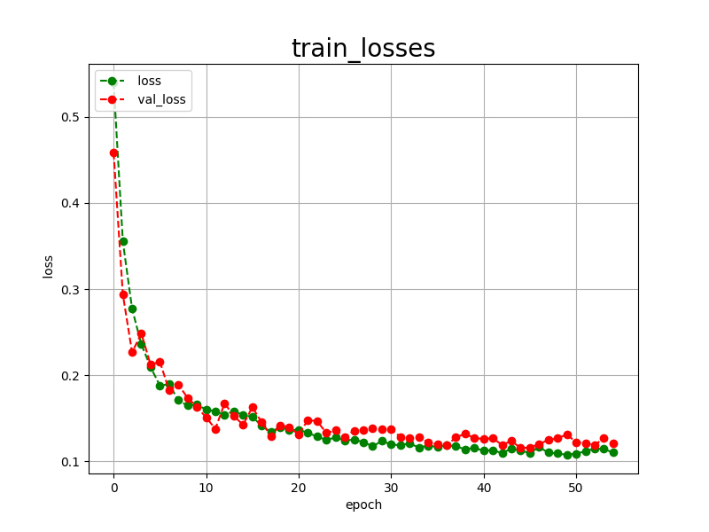

<h2>Tensorflow-Image-Segmentation-Augmented-Hippocampus (Updated: 2024/09/27)</h2>
<li>2024/02/21: Modified to use the latest dataset (rotated 90 degrees counterclockwise)
<a href="https://drive.google.com/file/d/1FAgeAlwvzCscZVvAovqpsTQdum90_7y-/view?usp=sharing">
Hippocampus-ImageMask-Dataset.zip</a>
</li>
<li>2024/02/21: Modified the parameters in [augmentor] section in 
    <a href="./projects/TensorflowSlightlyFlexibleUNet/Augmented-Hippocampus/train_eval_infer.config">train_eval_infer.config</a> 
</li>
<li>2024/02/23: Added [segmentation] section to 
<a href="./projects/TensorflowSlightlyFlexibleUNet/Augmented-Hippocampus/train_eval_infer.config">train_eval_infer.config</a> 
to be able to colorize the inferred segmentation regions.
</li>
<li>2024/02/23: Modified loss parameter in [model] setction to be "bce_dice_loss" in   
<a href="./projects/TensorflowSlightlyFlexibleUNet/Augmented-Hippocampus/train_eval_infer.config">train_eval_infer.config</a> 
</li>
<li>2024/02/23: Updated <a href="./src/TensorflowUNet.py">TensorflowUNet.py</a> and <a href="./src/GrayScaleImageWriter.py">GrayScaleImageWriter.py</a>.</li>
<li>2024/09/26: Modified to use the latest <a href="./src/VERSION.inf">VERSION</a> of  <a href="https://github.com/sarah-antillia/Tensorflow-Image-Segmentation-API">Tensorflow-Image-Segmentation-API</a>.
<li>2024/09/26: Modified to use <b>"dice_coef"</b> function as a metric 
in  <a href="./projects/TensorflowSlightlyFlexibleUNet/Augmented-Hippocampus/train_eval_infer.config">train_eval_infer.config</a>. 
 
  
This is the second experimental Image Segmentation project for Hippocampus based on
the <a href="https://github.com/sarah-antillia/Tensorflow-Image-Segmentation-API">Tensorflow-Image-Segmentation-API</a>, and
<a href="https://drive.google.com/file/d/1FAgeAlwvzCscZVvAovqpsTQdum90_7y-/view?usp=sharing">
Hippocampus-ImageMask-Dataset.zip</a> (Updated: 2024/02/21).

Please see also our first experiment 
<a href="https://github.com/atlan-antillia/Tensorflow-Image-Segmentation-Hippocampus">Tensorflow-Image-Segmentation-Hippocampus</a>
 
 
<b>Data Augmentation Strategy:</b> 
 To address the limited size of the Augmented-Hippocampus dataset, 
 we employed <a href="./src/ImageMaskAugmentor.py">an online augmentation tool</a> to enhance segmentation accuracy, 
 which supports the following augmentation methods.
<li>verticalflip</li>
<li>horizontalflip</li>
<li>rotation</li>
<li>shrinks</li>
<li>shears</li> 
<li>deformation</li>
<li>distortion</li>
<li>barreldistortion</li>
<li>pincushiondistortion</li>

On the augmentation parameters of these methods, please refer to <a href="./projects/TensorflowSlightlyFlexibleUNet/Augmented-Hippocampus/train_eval_infer.config">
train_eval_infer.config</a>. 

<b>Actual Image Segmentation for Images of 512x512 pixels</b> 
As shown below, the inferred masks look similar to the ground truth masks.  

<table>
<tr>
<th>Input: image</th>
<th>Mask (ground_truth)</th>
<th>Prediction: inferred_mask</th>
</tr>
<tr>
<td></td>
<td></td>
<td></td>
</tr>

<tr>
<td></td>
<td></td>
<td></td>
</tr>

<tr>
<td></td>
<td></td>
<td></td>
</tr>

</table>

We used the simple UNet Model <a href="./src/TensorflowUNet.py">TensorflowSlightlyFlexibleUNet</a> for this Hippocampus Segmentation. 
As shown in <a href="https://github.com/sarah-antillia/Tensorflow-Image-Segmentation-API">Tensorflow-Image-Segmentation-API</a>.
you may try other Tensorflow UNet Models: 

<li><a href="./src/TensorflowSwinUNet.py">TensorflowSwinUNet.py</a></li>
<li><a href="./src/TensorflowMultiResUNet.py">TensorflowMultiResUNet.py</a></li>
<li><a href="./src/TensorflowAttentionUNet.py">TensorflowAttentionUNet.py</a></li>
<li><a href="./src/TensorflowEfficientUNet.py">TensorflowEfficientUNet.py</a></li>
<li><a href="./src/TensorflowUNet3Plus.py">TensorflowUNet3Plus.py</a></li>
<li><a href="./src/TensorflowDeepLabV3Plus.py">TensorflowDeepLabV3Plus.py</a></li>
 

<h3>1. Dataset Citation</h3>

The original image dataset used here has been taken from the following kaggle web site. 
<a href="https://www.kaggle.com/datasets/andrewmvd/hippocampus-segmentation-in-mri-images">
Hippocampus Segmentation in MRI Images</a> 
 
<b>About Dataset</b>

<b>Introduction</b> 
The hippocampus is a structure within the brain that plays important roles in the 
consolidation of information from short-term memory to long-term memory, and in spatial 
memory that enables navigation. 
Magnetic resonance imaging is often the optimal modality for brain medical imaging studies, 
being T1 ideal for representing structure.
The hippocampus has become the focus of research in several neurodegenerative disorders. 
Automatic segmentation of this structure from magnetic resonance (MR) imaging scans of the 
brain facilitates this work, especially in resource poor environments.
 
 
<b>About This Dataset</b> 
This dataset contains T1-weighted MR images of 50 subjects, 40 of whom are patients with 
temporal lobe epilepsy and 10 are nonepileptic subjects. Hippocampus labels are provided 
for 25 subjects for training. For more information about the dataset, refer to the 
original article.
  
<b>How To Cite this Dataset</b> 
Original Article 
K. Jafari-Khouzani, K. Elisevich, S. Patel, and H. Soltanian-Zadeh,  
“Dataset of magnetic resonance images of nonepileptic subjects and temporal lobe epilepsy  
patients for validation of hippocampal segmentation techniques,”  
Neuroinformatics, 2011. 
 
<b>License</b> 
The dataset is free to use for research and education.  
Please refer to the original article if you use it in your publications. 
 
<b>Dataset BibTeX</b> 
@article{, 
title= {MRI Dataset for Hippocampus Segmentation (HFH) (hippseg_2011)}, 
keywords= {}, 
author= {K. Jafari-Khouzani and K. Elisevich, S. Patel and H. Soltanian-Zadeh}, 
abstract= {This dataset contains T1-weighted MR images of 50 subjects, 40 of whom are patients 
with temporal lobe epilepsy and 10 are nonepileptic subjects. Hippocampus labels are provided  
for 25 subjects for training. The users may submit their segmentation outcomes for the  
remaining 25 testing images to get a table of segmentation metrics.}, 
terms= {The dataset is free to use for research and education. Please refer to the following  
article if you use it in your publications: 
K. Jafari-Khouzani, K. Elisevich, S. Patel, and H. Soltanian-Zadeh,  
“Dataset of magnetic resonance images of nonepileptic subjects and temporal lobe epilepsy  
patients for validation of hippocampal segmentation techniques,” Neuroinformatics, 2011.}, 
license= {free to use for research and education}, 
superseded= {}, 
url= {https://www.nitrc.org/projects/hippseg_2011/} 
} 
 

<h3>
<a id="2">
2 Hippocampus ImageMask Dataset
</a>
</h3>
 If you would like to train this Hippocampus Segmentation model by yourself,
 please download the latest dataset(rotated 90 degrees counterclockwise) from the google drive 
<a href="https://drive.google.com/file/d/1FAgeAlwvzCscZVvAovqpsTQdum90_7y-/view?usp=sharing">
Hippocampus-ImageMask-Dataset.zip</a> (Updated: 2024/02/21).

Please see also the <a href="https://github.com/atlan-antillia/Hippocampus-Image-Dataset">Hippocampus-Image-Dataset</a>. 
Please expand the downloaded ImageMaskDataset and place them under <b>./dataset</b> folder to be

<pre>
./dataset
└─Hippocampus
    ├─test
    │  ├─images
    │  └─masks
    ├─train
    │  ├─images
    │  └─masks
    └─valid
        ├─images
        └─masks
</pre>
 
 
<b>Hippocampus Dataset Statistics</b> 
 

As shown above, the number of images of train and valid dataset is not necessarily large. Therefore the online dataset augmentation strategy may 
be effective to improve segmentation accuracy.

 
 
<b>Train_images_sample</b> 

 
<b>Train_masks_sample</b> 

 

<h3>
3. Train Tensorflow UNet Model
</h3>
 We trained Hippocampus TensorflowUNet Model by using the configuration file
<a href="./projects/TensorflowSlightlyFlexibleUNet/Augmented-Hippocampus/train_eval_infer.config"> <b>train_eval_infer.config</b></a> file.  
Please move to ./projects/TensorflowSlightlyFlexibleUNet/Augmented-Hippocampus and run the following bat file. 
<pre>
>1.train.bat
</pre>
, which simply runs the following command. 
<pre>
>python ../../../src/TensorflowUNetTrainer.py ./train_eval_infer.config
</pre>

<b>Model parameters</b> 
Defined a small <b>base_filters</b> and large <b>base_kernels</b> for the first Conv Layer of Encoder Block of 
<a href="./src/TensorflowUNet.py">TensorflowUNet.py</a> 
and a large num_layers (including a bridge between Encoder and Decoder Blocks).
<pre>
[model]
model          = "TensorflowUNet"
generator      = True
image_width    = 512
image_height   = 512
image_channels = 3
base_filters   = 16
base_kernels   = (9,9)
num_layers     = 8
</pre>

<b>Learning rate</b> 
Defined a small learning rate.  
<pre>
[model]
learning_rate  = 0.00007
</pre>

<b>Online augmentation</b> 
Enabled our online augmentation.  
<pre>
[model]
model         = "TensorflowUNet"
generator     = True
</pre>

<b>Loss and metrics functions</b> 
Specified "bce_dice_loss" and "dice_coef". 
<pre>
[model]
loss           = "bce_dice_loss"
metrics        = ["dice_coef"]
</pre>
<b>Learning rate reducer callback</b> 
Enabled learing_rate_reducer callback, and a small reducer_patience.
<pre> 
[train]
learning_rate_reducer = True
reducer_factor     = 0.4
reducer_patience   = 4
</pre>

<b>Early stopping callback</b> 
Enabled early stopping callback with patience parameter.
<pre>
[train]
patience      = 10
</pre>

<b>Epoch change inference callbacks</b> 
Enabled epoch_change_infer and epoch_changeinfer callbacks. 
<pre>
[train]
epoch_change_infer       = True
epoch_change_infer_dir   =  "./epoch_change_infer"
epoch_changeinfer        = False
epoch_changeinfer_dir    = "./epoch_changeinfer"
num_infer_images         = 1
</pre>

By using these callbacks, on every epoch_change, the inference procedures can be called
 for an image in <b>mini_test</b> folder. These will help you confirm how the predicted mask changes 
 at each epoch during your training process.    

<b>Epoch_change_inference output</b> 
 
 

In this experiment, the training process was stopped at epoch 55 by EarlyStopping Callback.  
 
 
 
<a href="./projects/TensorflowSlightlyFlexibleUNet/Augmented-Hippocampus/eval/train_metrics.csv">train_metrics.csv</a> 
 

 
<a href="./projects/TensorflowSlightlyFlexibleUNet/Augmented-Hippocampus/eval/train_losses.csv">train_losses.csv</a> 
 
 

<h3>
4.Evaluation
</h3>
Please move to a <b>./projects/TensorflowSlightlyFlexibleUNet/Augmented-Hippocampus</b> folder, 
and run the following bat file to evaluate TensorflowUNet model for Hippocampus. 
<pre>
./2.evaluate.bat
</pre>
<pre>
python ../../../src/TensorflowUNetEvaluator.py ./train_eval_infer_aug.config
</pre>
Evaluation console output: 

 
The loss (bce_dice_loss) to this Alzheimer-s-Disease/test was low, and dice_coef not so high as shown below.
 
<pre>
loss,0.1075
dice_coef,0.7973
</pre>

<h2>
5. Inference
</h2>
Please move to a <b>./projects/TensorflowSlightlyFlexibleUNet/Augmented-Hippocampus</b> folder 
,and run the following bat file to infer segmentation regions for images by the Trained-TensorflowUNet model for Hippocampus. 
<pre>
./3.infer.bat
</pre>
<pre>
python ../../../src/TensorflowUNetInferencer.py ./train_eval_infer_aug.config
</pre>
Sample test images 
 
Sample test mask (ground_truth) 
 

 
Inferred test masks 
 
 

<b>Enlarged images and masks </b> 

<table>
<tr>
<th>Image</th>
<th>Mask (ground_truth)</th>
<th>Inferred-mask</th>
</tr>

<tr>
<td></td>
<td></td>
<td></td>
</tr>

<tr>
<td></td>
<td></td>
<td></td>
</tr>

<tr>
<td></td>
<td></td>
<td></td>
</tr>
<tr>
<td></td>
<td></td>
<td></td>
</tr>
<tr>
<td></td>
<td></td>
<td></td>
</tr>
</table>

 

<h3>
References
</h3>
<b>1. Hippocampus Segmentation Method Applying Coordinate Attention Mechanism and Dynamic Convolution Network</b> 
Juan Jiang, Hong Liu 1ORCID,Xin Yu,Jin Zhan, ORCID,Bing Xiong andLidan Kuang 
Appl. Sci. 2023, 13(13), 7921; https://doi.org/10.3390/app13137921 
<pre>
https://www.mdpi.com/2076-3417/13/13/7921
</pre>

<b>2. Hippocampus Segmentation Using U-Net Convolutional Network from Brain Magnetic Resonance Imaging (MRI)</b> 
Ruhul Amin Hazarika, Arnab Kumar Maji, Raplang Syiem, Samarendra Nath Sur, Debdatta Kandar 
PMID: 35304675 PMCID: PMC9485390 DOI: 10.1007/s10278-022-00613-y 
<pre>
https://pubmed.ncbi.nlm.nih.gov/35304675/
</pre>

<b>3. Hippocampus-Image-Dataset </b> 
Toshiyuki Arai @antillia.com 
<pre>
https://github.com/atlan-antillia/Hippocampus-Image-Dataset
</pre>

<b>4. Tensorflow-Image-Segmentation-Hippocampus</b> 
Toshiyuki Arai @antillia.com 
<pre>
https://github.com/atlan-antillia/Tensorflow-Image-Segmentation-Hippocampus
</pre>

